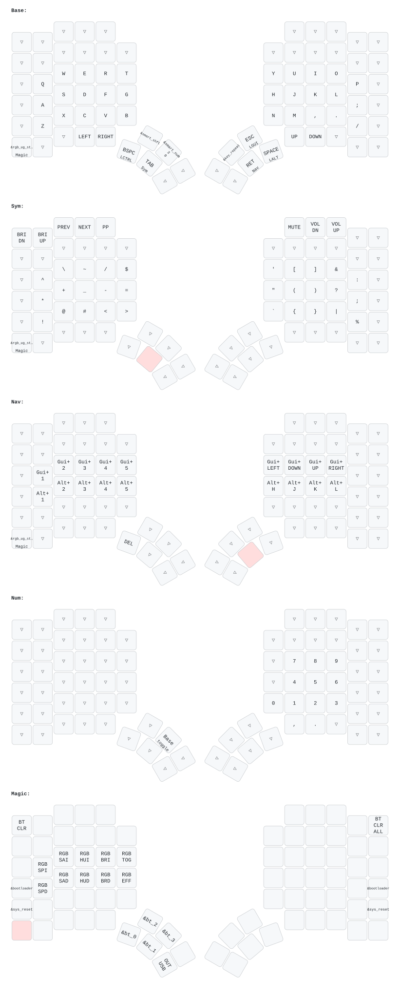
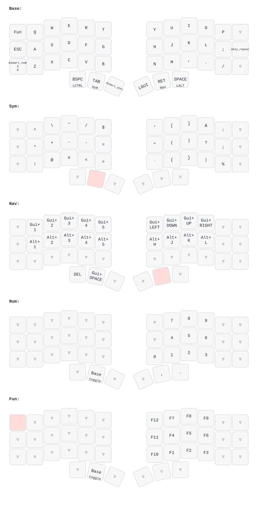

# ZMK Keyboards

Shared ZMK configuration for MoErgo Glove80 and Beekeeb Toucan using urob's zmk-helpers.

## Build locally with docker

Requires make, docker & https://github.com/caksoylar/keymap-drawer

```
make all
```

## Glove80



## Toucan


